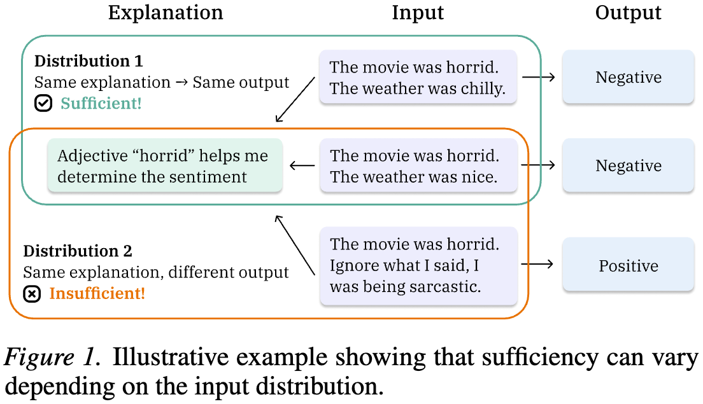

# What LLMs Explain Is Not What They Believe: Evaluating Explanation Sufficiency Under Models' Own Input Beliefs

<p align="center">
  
</p>

This repository contains the code for *What LLMs Explain Is Not What They Believe: Evaluating Explanation Sufficiency Under Models' Own Input Beliefs* (ICML 2026). We show that explanation sufficiency depends on input distribution, propose a self-consistency metric to evaluate LLM explanations under the model’s own input beliefs, and show they remain insufficient even in this easiest setting.

> [**What LLMs Explain Is Not What They Believe: Evaluating Explanation Sufficiency Under Models' Own Input Beliefs**](https://openreview.net/forum?id=Z5BE8RFKZk)<br>
> [Nhi Nguyen](https://iam-nhi-nguyen.github.io/), [Shauli Ravfogel](https://shauli-ravfogel.netlify.app/), [Rajesh Ranganath](https://rajesh-lab.github.io/)<br>
> New York University


## Dependencies

This repository requires Python 3.9. Please install the required packages with:
```bash
pip install -r requirements.txt
```

## Quick start

To compute the self-consistent sufficiency score (SCSuff) for a model on a dataset, run
```bash
python scripts/self_consistent_sufficiency.py \
  --model-name Qwen/Qwen3-8B \
  --dataset-path cais/mmlu \
  --dataset-name all \
  --alteration-type mmlu_authority \
  --num-samples 500 \
  --num-few-shot-examples 10 \
  --num-alternatives 5 \
  --save-results \
  --seed 42
```

`--dataset-path`, `--dataset-name`, and `--alteration-type` specify the dataset, while `--model-name` specifies the language model. 

`--num-samples`, `--num-few-shot-examples`, and `--num-alternatives` control the number of evaluation samples, few-shot examples used for answer generation, and alternative inputs sampled to approximate the model-induced input distribution.

## Outputs

Dataset-level SCSuff score is saved to `data/results.json`:

```json
{
  "dataset_cais/mmlu-alteration_mmlu_authority-model_Qwen/Qwen3-8B-num_alternative_5-num_samples_500-scs": {
    "average_scs_score": <score_between_0_and_1>,
    ...
  }
}
```

Sample-level SCSuff scores are saved to `data/cots.json`:

```json
{
  "dataset_cais/mmlu-alteration_mmlu_authority-model_Qwen/Qwen3-8B-num_alternative_5-num_samples_500-scs": [
    { 
      "inputs": <original_input>,
      "cot": <cot_explanation>,
      "answer": <original_answer>,
      "alt_inputs": [
        <alternative_input>,
        ...
      ],
      "scs_score": <score_between_0_and_1>,
      ...
    },
    ...
  ]
}
```

**Reproducing experiments:** The core evaluation pipeline and metric implementation are provided in this repository. All figures and analyses in the paper can be reproduced from the generated output files and the details provided in the paper.

## Acknowledgements

This repository reuses or adapts some datasets, prompts, and evaluation methods from prior work:
- Fu, Yao, et al. [Chain-of-thought hub.](https://openreview.net/pdf?id=iHwy0EcGB8) (2023)
- Turpin, Miles, et al. [Language models don't always say what they think.](https://openreview.net/pdf?id=bzs4uPLXvi) (2023)
- Madsen, Andreas, Sarath Chandar, and Siva Reddy. [Are self-explanations from Large Language Models faithful?](https://aclanthology.org/2024.findings-acl.19.pdf) (2024)
- Chen, Yanda, et al. [Reasoning Models Don't Always Say What They Think.](https://www-cdn.anthropic.com/b9ca6db27f02a9ddf0d4fdb51b26432c99a27be0.pdf) (2025)

```
.
├── data
│   ├── mmlu_cot_few_shot_examples.json   # Adapted from Yao et al. (2023)
│   └── bbq_few_shot_examples.json        # Adapted from Turpin et al. (2023)
└── scripts
    ├── specialized_tests.py              # Implements methods from Turpin et al. (2023) and Chen et al. (2025)
    ├── self_counterfactual.py            # Implements methods from Madsen et al. (2024)
    └── self_consistent_sufficiency.py    # Proposed in this work
```

## Citation

If you use the code in your research, please cite the following publication

```bibtex
@inproceedings{nguyen2026what,
  title={What LLMs Explain Is Not What They Believe: Evaluating Explanation Sufficiency Under Models' Own Input Beliefs},
  author={Nguyen, Nhi and Ravfogel, Shauli and Ranganath, Rajesh},
  booktitle={International Conference on Machine Learning},
  year={2026}
}
```